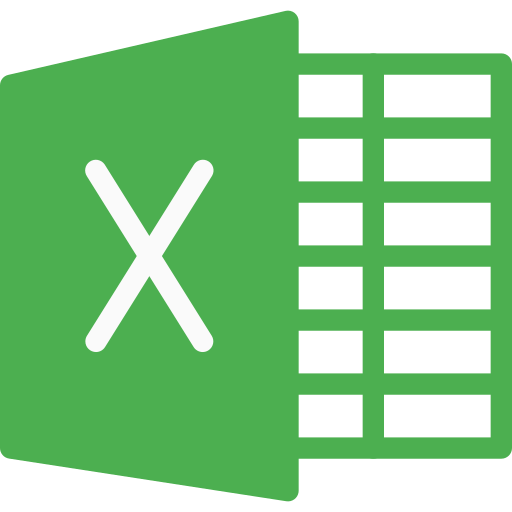
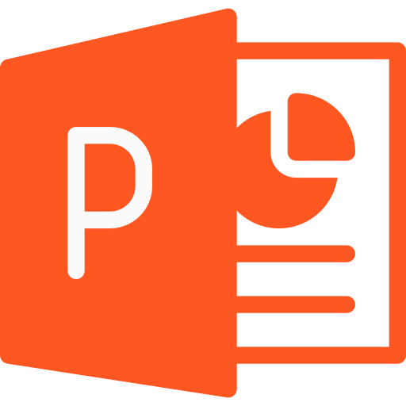
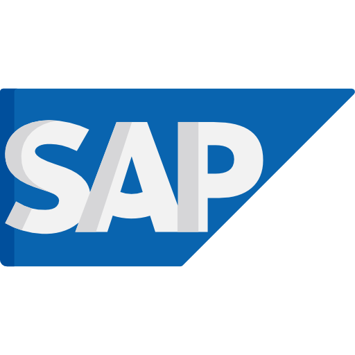
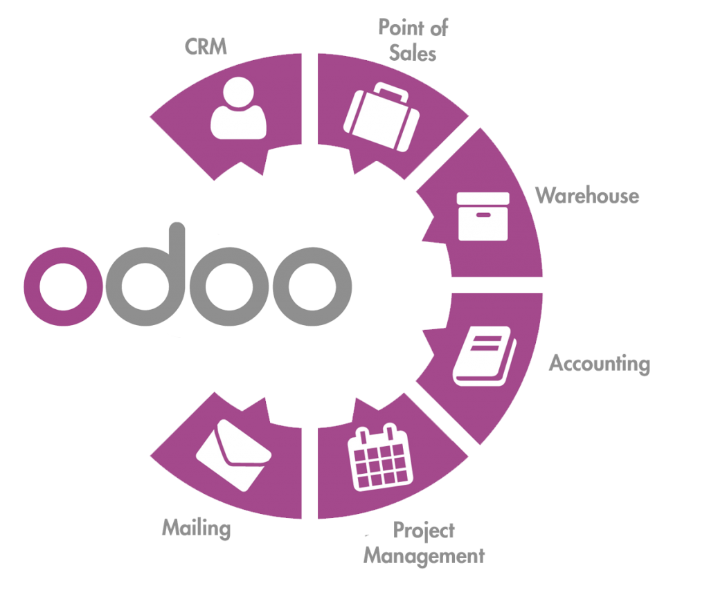
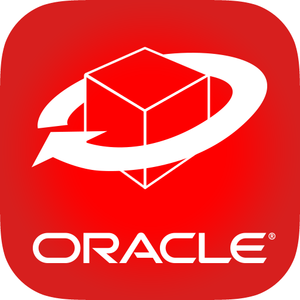
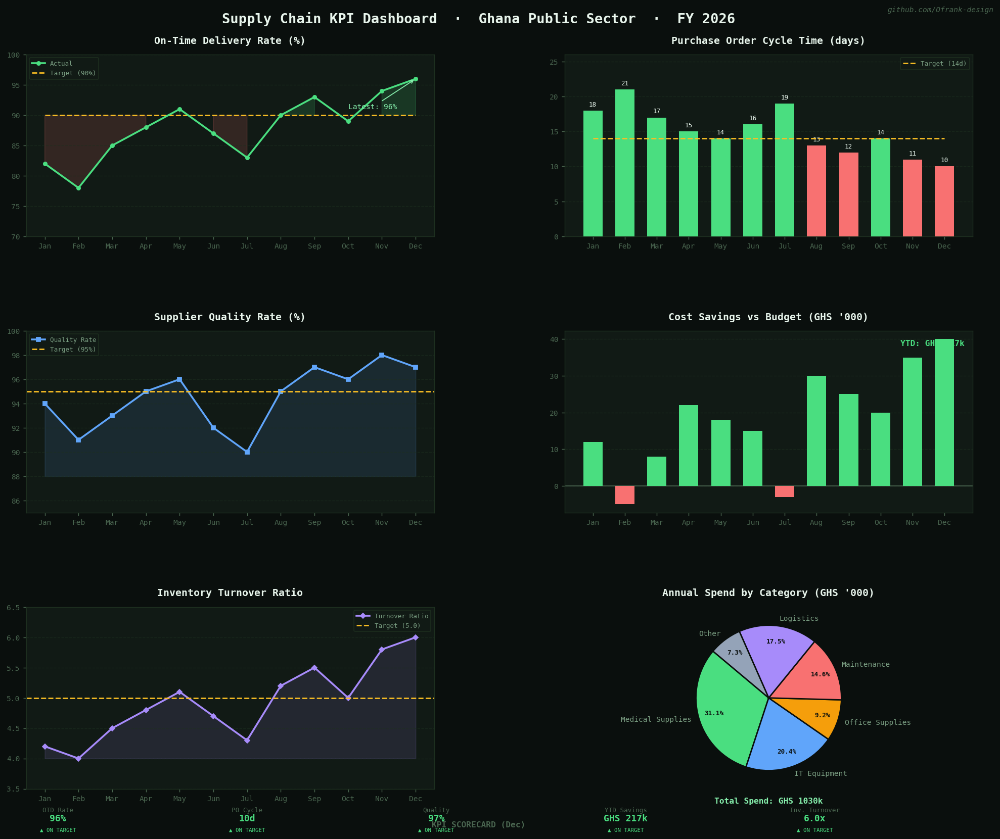

🌐 Live Portfolio

**[▶ Visit my Portfolio →](https://ofrank-design.github.io)**

# 🛠️ Procurement & Logistics Toolkit

> A free, browser-based toolkit for supply chain and procurement professionals  no login, no install, no cost.

[▶ Live Demo →](https://ofrank-design.github.io/procurement-logistics-toolkit)

# 📊 SCM Projects  Python & JavaScript
 
> Two practical supply chain projects built from scratch a KPI dashboard in Python and a procurement quiz game in JavaScript.

[▶Life Demo →]( https://ofrank-design.github.io/Supply-chain-management-TrialProject/) 


<!--Night Owl image-->
<div>
  
</div>

<!-- BADGES -->
<!--Profile Count Badge-->
<p align="left"> 
  
 


<picture>
  <source media="(prefers-color-scheme: dark)" srcset="./Skills_Animation_Dark.gif">
  <source media="(prefers-color-scheme: light)" srcset="./Skills_Animation_White.gif">
  
</picture>

#### 📦 Procurement & Supply Chain


#### 📊 Analytics & Tools
<p>
  
  
  
  
  
</p>

#### ⚙️ ERP Systems
<p>
  
  
  
  
</p>

#### 🛠️ Dev & Productivity
<p>
  
  
  
  
</p>

# Hi, I'm Frank Oduro 👋

> *"Bridging academic theory with hands-on supply chain innovation from Day 1."*

I am a Procurement and Supply Chain Management student at Kumasi Technical University (KsTU), enrolled in October 2026. Rather than relying solely on traditional coursework, I am proactively utilizing this GitHub repository as a digital portfolio to document practical applications of my learning ahead of my 2030 graduation.

### 💼 What I am Building
Here, you will find active projects focused on public data, operational transparency, and operational efficiency:
- **Data-Driven Dashboards:** Live analytical tools built utilizing Ghanaian public sector procurement data.
- **Enterprise Resource Planning (ERP):** Simulated end-to-end ERP transaction workflows and inventory models.
- **Contract Management:** Standardized Service Level Agreements (SLAs) and automated supplier scorecards.

My goal is to graduate with a verified track record of technical competence, providing prospective employers and collaborators with transparent, measurable evidence of my strategic procurement skills.

---

## 🛠️ Technical Skills

<table>
<tr>
<td width="50%">

### ⚙️ ERP Systems


Full procure-to-pay cycle: Vendor → PR → PO → GR → Invoice

</td>
<td width="50%">

### 📊 Procurement Analytics


Spend analysis · Supplier dashboards · SCOR metrics

</td>
</tr>
<tr>
<td>

### 📋 Contract Management


UNDP templates · Framework agreements · KPI benchmarking

</td>
<td>

### ⚖️ Compliance & Ethics


Ghana e-GP portal · ESG sourcing · Public procurement law

</td>
</tr>
<tr>
<td>

### 📦 Inventory & Logistics


Safety stock · Demand forecasting · Reorder points

</td>
<td>

### 🎯 Strategic Sourcing


CIPS 7-step framework · Make-vs-buy · Competitive tendering

</td>
</tr>
</table>

---

## 📁 Portfolio Projects

| # | Project | Skills | Status |
|---|---------|--------|--------|
| 01 | **ERP: SAP MM Procure-to-Pay Workflow** | SAP S/4HANA · Full P2P cycle | 🔵 Year 2 · 2027 |
| 02 | **Contract Management: Mock SLA & Negotiation** | UNDP templates · 5-page SLA | 🔵 Year 2 · 2027 |
| 03 | **Supplier Scorecard & KPI Dashboard** | Excel · Power BI · 10 vendors | 🟣 Year 3 · 2028 |
| **04** | **✅ Inventory Optimization Model** | **Excel · EOQ · ABC · Safety Stock** | **✅ Completed** |
| 05 | **Procurement Analytics: Ghana Spend Dashboard** | Power BI · Ghana e-GP data | 🟣 Year 3 · 2028 |
| 06 | **Strategic Sourcing: IT Category Plan** | CIPS 7-step · TCO model | 🟡 Year 4 · 2029 |
| 07 | **Compliance & Ethics: Tender Risk Assessment** | Acts 663 & 914 · Risk matrix | 🟣 Year 3 · 2028 |

**[▶ View Full Portfolio →](https://ofrank-design.github.io)**


## 🎓 Certifications

> 17 free, self-paced certifications mapped to 7 projects and 28 KSTU modules.

| Program | Provider | Status |
|---------|----------|--------|
| ✅ Inventory Management Certificate | HP LIFE | **Completed** |
| ✅ Business Communication Certificate | HP LIFE | **Completed** |
| ✅ Agile Project Management | HP LIFE | **Completed** |
| ⏳ Excel & Data Analysis Learning Path | Microsoft Learn | In Progress |
| SAP ERP Essential Training | openSAP | Year 2 |
| Law and Contract Management | OpenLearn | Year 2 |
| Power BI Learning Path | Microsoft Learn | Year 2 |
| Supply Chain Analytics | World Bank | Year 3 |
| Strategic Sourcing & Category Management | CIPS | Year 3 |
| E-Procurement Learning Program | World Bank | Year 3 |
| Procurement and Contract Management | UniAthena | Year 3 |
| ESG & Sustainable Business Practices | UN Global Compact | Year 3–4 |
| Global Logistics & SCM | World Bank Open Learning | Year 2–3 |
| Data Analysis with Python | IBM Cognitive Class | Year 3 |
| Lean Six Sigma White Belt | 6sigmastudy | Year 3 |
| Oracle Procurement Cloud Fundamentals | Oracle University | Year 2 |
| Microsoft Dynamics 365 Fundamentals | Microsoft Learn | Year 4 |

**[▶ View Full Certifications →](https://ofrank-design.github.io)**


## 🗺️ 4-Year Roadmap

```
2026 ──────────────────────────────────────────────── 2030
  │                                                      │
  ▼ YEAR 1        ▼ YEAR 2       ▼ YEAR 3   ▼ YEAR 4   │
  Foundation      ERP & SLA      Analytics  Specialise  │
  ──────────      ─────────      ─────────  ──────────  │
  ✅ Project 4    Projects 1&2   3, 5, 7    Project 6   │
  Excel mastery   SAP · Oracle   Internship MS Dynamics  │
  Odoo · Acts     Power BI       Dashboard  Thesis      │
  9 Certs         9 Certs        10 Certs   All 17 ✅   │
```


### 📈 Supply Chain KPI Dashboard  Python

A fully coded KPI dashboard built with Python and matplotlib, visualising six key supply chain metrics for a Ghana public sector context.

**Charts included:**
- On-Time Delivery Rate vs target (line chart)
- Purchase Order Cycle Time (bar chart)
- Supplier Quality Rate (line + fill)
- Cost Savings vs Budget — GHS (bar chart, green/red)
- Inventory Turnover Ratio (line chart)
- Annual Spend by Category (pie chart)

**KPI Scorecard** at the bottom summarises December performance at a glance — green for on target, red for below.



<h2 align="center"> 📈 GitHub Stats </h2>

<p align="center">
  
  
</p>

<p align="center">
  
</p>
<h2 align="center">🌐 Languages & Badges</h2>

<h2 align="center">🏆 GitHub Trophies </h2>

<p align="center">
  

<h2 align="center">📈 Contribution Graph </h2>

<p align="center">
  
</p>

<h2 align="center">🤝 Cᴏɴɴᴇᴄᴛ Wɪᴛʜ Mᴇ 🤝 </h2>
<div align="center">
  
<a href="mailto:frankoduro1912@gmail.com" target="_blank">

</a>

<a href="https://x.com/odee_frank" target="_blank">

</a>

<a href="https://www.instagram.com/_anonymoustroy" target="_blank">

</a>

<a href="https://www.githubcom/ofrank-design" target="_blank">

</a>
<a href="https://www.linkedin.com/in/ofrank-design/" target="_blank">

</a>

<div align="center">

<!--Buy me a coffee-->
<div align="center">
<a href="https://www.buymeacoffee.com/ofrankdesign" target="_blank"></a>
</div>


<!--Footer--> 
<p align="center">
  
</p>

*📍 Kumasi, Ghana · KSTU BSc Procurement & Supply Chain Management · Enrolled Oct 2026*
<p align="center">
  <i>“The way to get started is to quit talking and begin doing.”</i><br>
  <strong>— Walt Disney</strong>
</p>

LAST UPDATED: 23TH, JUNE 2026

</div>
