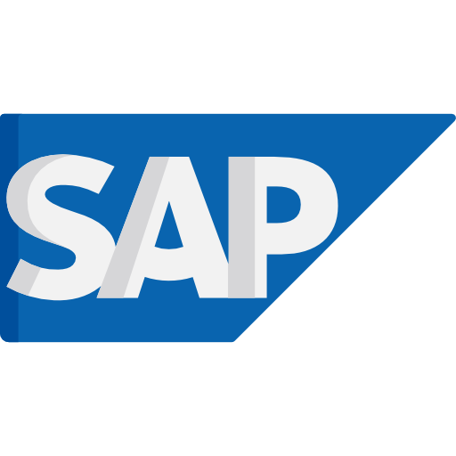
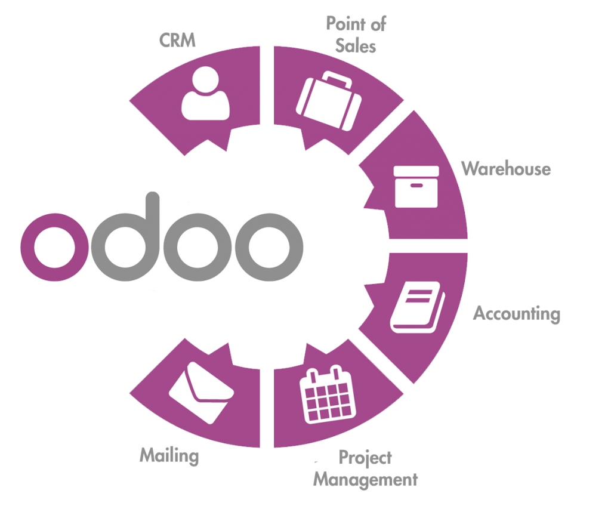
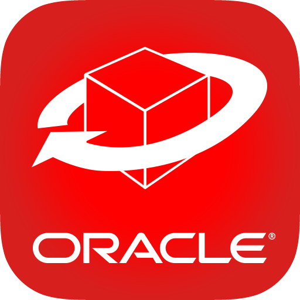

<div align="center">

# 👋 Hi, I'm Frank Oduro

### Procurement & Supply Chain Specialist | Full-Stack Web Developer

**Procurement • Supply Chain • ERP • Business Technology • Web Development**

I combine procurement and supply chain knowledge with software development to build practical digital solutions for purchasing, suppliers, inventory, logistics, analytics, and business operations.

<a href="https://ofrank-design.github.io">

</a>

<a href="https://github.com/Ofrank-design">

</a>

</div>

---

# 👨‍💼 About Me

I am a **Procurement & Supply Chain Management professional** with a strong interest in the intersection between **business operations and technology**.

My work focuses on understanding how organizations purchase, manage suppliers, control inventory, coordinate logistics, manage contracts, and make operational decisions — and using technology to make those processes more efficient, transparent, and data-driven.

Alongside my procurement and supply chain specialization, I have developed practical experience in **full-stack web development**, building complete websites and business applications from frontend interfaces to backend functionality and data-driven systems.

### My professional focus

* 📦 Procurement & Purchasing
* 🚚 Supply Chain Management
* 🤝 Supplier Management
* 📊 Procurement & Supply Chain Analytics
* 🏢 ERP & Business Management Systems
* 📋 Contract & Tender Management
* 📈 Inventory Optimization
* 🌐 Full-Stack Web Development
* 💻 Business Applications & SaaS
* ⚙️ Digital Process Automation

---

# 🧠 The Intersection

My goal isn't simply to work in procurement or simply to write code.

I am interested in **using technology to solve real procurement and supply chain problems**.

That means understanding the business process first and then thinking about how software can improve it:

```text
Business Problem
       ↓
Process & Workflow
       ↓
Data & Requirements
       ↓
Software Solution
       ↓
Automation
       ↓
Analytics & Visibility
       ↓
Better Decisions
```

This perspective is what led me to start building **Pavos**, a procurement and supply chain management platform designed around real organizational workflows.

---

# 🛠️ Technical Skills

## 💻 Web Development

<p>


</p>

### Backend & Data

<p>


</p>

### Development Tools

<p>


</p>

---

# 📦 Procurement & Supply Chain

### Procurement

* Strategic Sourcing
* Procurement Planning
* Purchase Requisitions
* Purchase Orders
* RFQs & Tendering
* Supplier Evaluation
* Contract Management
* Spend Analysis
* Total Cost of Ownership
* Procurement Compliance

### Supply Chain

* Inventory Management
* EOQ Modelling
* ABC Analysis
* Safety Stock
* Reorder Points
* Demand & Supply Planning
* Logistics Planning
* Supplier Performance
* Supply Chain KPIs
* Operational Analytics

### Enterprise Systems

<p>




</p>

---

# 🚀 Featured Projects

## 🏢 Pavos ERP

### Procurement & Supply Chain Management Platform

**Currently Building**

Pavos is a procurement and supply chain management platform built for organizations that need clear visibility into purchasing, suppliers, budgets, inventory, and logistics.

It is designed to replace scattered spreadsheets and manual tracking with a connected workspace where teams can work from the same accurate data.

### Core capabilities

* 📋 Purchase Requisitions
* 🧾 Purchase Orders
* 🤝 Supplier Management
* 🧠 Supplier Intelligence
* 📊 Supplier Scorecards
* 🎯 Tender Tracking
* 💰 Budget & Spend Management
* 📦 Inventory Optimization
* 🚚 Logistics Planning
* 🧮 EOQ & Safety Stock Calculations
* 💵 Landed Cost Analysis
* 🌱 Carbon Footprint Tracking
* 🏭 Warehouse Space Optimization
* 🔔 Notifications & Alerts
* 📑 Automated Documents & Reports
* 🔐 Role-Based Access & Organization Isolation
* 📝 Unified Audit Trail

### Supplier Intelligence

Pavos treats suppliers as more than entries in a database.

Each supplier can have a detailed profile containing industry information, tags, registration details, years in operation, performance information, and documentation.

Weighted supplier scorecards generate supplier grades, while document expiry alerts help organizations identify upcoming or expired certifications.

### Budgets & Spend

Department budgets are tracked against live committed spend derived from approved and completed requisitions.

Dashboard alerts surface departments approaching or exceeding their allocated budgets, helping organizations identify potential overspending earlier.

### Reporting & Notifications

Pavos generates operational documents including purchase orders, supplier intelligence summaries, and calculation histories.

A centralized notification system provides alerts for:

* Overdue tenders
* Expiring supplier documents
* Budget concerns
* Operational events

Notifications can be surfaced inside the application and delivered through email.

### Architecture & Scalability

Each organization operates within its own secure database space, keeping organizational information isolated.

The platform is designed to grow from a small procurement team into a multi-department organization while maintaining centralized data, access control, workflows, and auditability.

**Focus:** ERP · Procurement Technology · Supply Chain · SaaS · Business Automation · Full-Stack Development

> 🚧 **Pavos is currently under active development.**

---

# 🌐 Web Development Projects

## 01 — Meridian

### Professional Services Website

A modern professional-services website designed to present a business, its services, value proposition, and digital presence through a polished responsive interface.

**Type:** Business / Professional Services Website

🔗 **Live Project:**
https://meridian-co-omega.vercel.app/

---

## 02 — E-Commerce Platform

### E-Commerce Website

A modern e-commerce experience focused on product presentation, browsing, and an online purchasing journey.

**Type:** E-Commerce

🔗 **Live Project:**
https://e-commernce-zeta.vercel.app/

---

## 03 — Fitness Coach

### Fitness Coaching Website

A professional fitness coaching website designed to showcase coaching services, programs, personal branding, and client-focused information.

**Type:** Fitness / Personal Brand

🔗 **Live Project:**
https://fitness-seven-blond.vercel.app/

---

## 04 — Supply Chain KPI Dashboard

### Procurement & Supply Chain Analytics

A coded analytical dashboard built around operational supply chain KPIs.

### Metrics include

* On-Time Delivery Rate
* Purchase Order Cycle Time
* Supplier Quality Rate
* Cost Savings vs Budget
* Inventory Turnover Ratio
* Annual Spend by Category

**Technologies:** Python · Matplotlib · Data Visualization

---

# 🏗️ What I'm Building

### Pavos ERP

My primary software project — developing a comprehensive procurement and supply chain platform covering:

**Procurement → Suppliers → Tenders → Budgets → Inventory → Logistics → Analytics → Automation**

The objective is to create software that addresses real operational problems faced by procurement and supply chain teams.

---

# 📊 Procurement Analytics

I also work with data and analytical models to turn operational information into useful decision-making tools.

Areas of interest include:

* Supplier performance
* Spend analysis
* Inventory optimization
* Procurement KPIs
* Cost analysis
* Demand planning
* Supply chain performance
* Operational dashboards

---

# 🎓 Professional Development

My procurement and supply chain development includes exposure to:

* Procurement Management
* Supply Chain Management
* ERP Systems
* Contract Management
* Inventory Management
* Strategic Sourcing
* Procurement Analytics
* Public Procurement
* Supplier Management
* Logistics

I continue to develop my technical and professional capabilities through practical projects, software development, and industry-focused learning.

---

# 🎯 Professional Direction

I am building toward a career at the intersection of:

```text
PROCUREMENT
     +
SUPPLY CHAIN
     +
TECHNOLOGY
     +
DATA
     ↓
DIGITAL PROCUREMENT & ENTERPRISE TECHNOLOGY
```

I am particularly interested in opportunities involving:

* Procurement
* Supply Chain
* Procurement Technology
* ERP Systems
* Business Analysis
* Supply Chain Analytics
* Digital Transformation
* Enterprise Software
* Full-Stack Development

---

# 📊 GitHub Stats

<div align="center">


</div>

<div align="center">


</div>

---

# 🤝 Connect With Me

<div align="center">

<a href="mailto:frankoduro1912@gmail.com">

</a>

<a href="https://x.com/odee_frank">

</a>

<a href="https://www.instagram.com/_anonymoustroy">

</a>

<a href="https://github.com/Ofrank-design">

</a>

<a href="https://www.linkedin.com/in/ofrank-design/">

</a>

</div>

---

<div align="center">

### 📦 Procurement. 🌐 Technology. 📊 Data. 🚀 Digital Transformation.

**Building practical technology for real-world business problems.**

📍 Ghana

</div>
