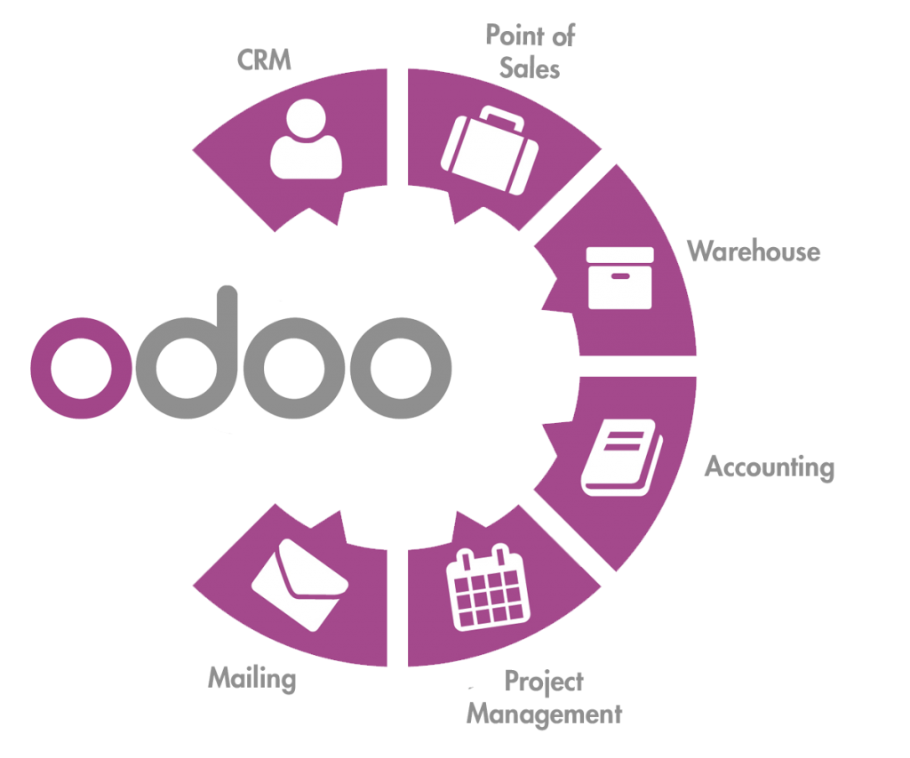
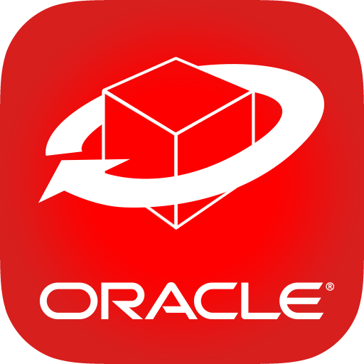

<!--Night Owl image-->

<div>
  
</div>
<div align="center">

# 👋 Hi, I'm Frank Oduro

### Procurement Technology Builder · Full-Stack Web Developer · Supply Chain Systems

**Procurement** · **Supply Chain** · **ERP Systems** · **Business Automation** · **SaaS** · **Analytics**

I combine procurement and supply chain knowledge with software development to build practical digital solutions for purchasing, suppliers, inventory, logistics, analytics, and business operations.

<br />

<a href="https://ofrank-design.github.io">
  
</a>

<a href="https://github.com/Ofrank-design">
  
</a>

</div>
<picture>
  <source media="(prefers-color-scheme: dark)" srcset="./Skills_Animation_Dark.gif">
  <source media="(prefers-color-scheme: light)" srcset="./Skills_Animation_White.gif">
  
</picture>


</div>

---
**Building practical software for procurement workflows, supply chain visibility, and operational decision-making.**

<br />

`PROCUREMENT` · `SUPPLY CHAIN` · `ERP SYSTEMS` · `B2B SAAS` · `AUTOMATION` · `ANALYTICS`

<p>
  <a href="https://github.com/Ofrank-design">
    
  </a>
  
</p>

</div>

---

## `about_me`

I work at the intersection of **procurement operations, supply chain systems, and software development**.

My focus is understanding how organizations purchase goods and services, manage suppliers, control inventory, coordinate logistics, monitor budgets, and make operational decisions—then translating those workflows into digital tools that are more structured, transparent, and data-driven.

Alongside my procurement and supply chain background, I build full-stack websites and business applications: from responsive user interfaces to data models, APIs, dashboards, and workflow automation.

```text
Business Process
      ↓
Workflow Design
      ↓
Data & Requirements
      ↓
Software Product
      ↓
Automation & Analytics
      ↓
Better Operational Decisions
```

### `focus_areas`

```yaml
procurement:
  - Purchasing workflows
  - Supplier management
  - Tender and contract processes
  - Budget and spend visibility

supply_chain:
  - Inventory management
  - Logistics coordination
  - Inventory optimization
  - Supplier performance

technology:
  - Full-stack web development
  - ERP and business systems
  - SaaS product development
  - Business process automation
  - Procurement and supply chain analytics
```

> Currently building **Pavos** — a procurement and supply chain platform for supplier management, purchasing workflows, budgets, inventory, logistics, analytics, and operational automation.

---

```text
┌──────────────────────────────────────────────────────────────────┐
│  BUSINESS OPERATIONS + SOFTWARE ENGINEERING + DATA               │
│                                                                  │
│  Procurement workflows → Digital systems → Automation → Insight  │
│                                                                  │
│  Building practical tools for better purchasing, supplier,       │
│  inventory, budget, and logistics decisions.                     │
└──────────────────────────────────────────────────────────────────┘
```

## `whoami`

```js
const frank = {
  location: "Accra, Ghana",
  focus: [
    "Procurement Technology",
    "Supply Chain Systems",
    "Full-Stack Web Development",
    "Business Process Automation",
    "Analytics & Decision Support"
  ],
  currentlyBuilding: "Pavos — Procurement & Supply Chain ERP",
  mission: "Turn fragmented operational workflows into connected software systems."
};
```

I am interested in more than just procurement and more than just coding.

My work sits at the intersection of **business operations, technology, and data**. I start by understanding how a process works in the real world, identify the bottlenecks, then design software that makes that process more visible, structured, and scalable.

```text
Operational Challenge
        ↓
Workflow Analysis
        ↓
Data Model & Business Rules
        ↓
Software Interface
        ↓
Automation
        ↓
Analytics & Visibility
        ↓
Better Decisions
```

---

## `stack`

### Frontend Engineering

<p>
  
  
  
  
  
  
</p>

### Backend, APIs & Data

<p>
  
  
  
  
  
</p>

### Development Environment

<p>
  
  
  
  
  
  
</p>

---

## `domain_expertise`

<table>
<tr>
<td width="50%" valign="top">

### Procurement

```text
✓ Strategic sourcing
✓ Procurement planning
✓ Purchase requisitions
✓ Purchase orders
✓ Tender management
✓ Supplier evaluation
✓ Contract awareness
✓ Budget monitoring
```

</td>
<td width="50%" valign="top">

### Supply Chain

```text
✓ Inventory management
✓ EOQ modelling
✓ Safety stock concepts
✓ Landed-cost analysis
✓ Logistics planning
✓ Warehouse optimization
✓ Supplier performance
✓ Operational KPIs
```

</td>
</tr>
</table>

### Enterprise Systems

<p>
  
  &nbsp;&nbsp;
  
  &nbsp;&nbsp;
  
  &nbsp;&nbsp;
  
</p>

> Exploring how enterprise workflows, data structures, approvals, roles, reporting, and automation translate into modern software products.

---

# `01` — Pavos ERP

## Procurement & Supply Chain Operating System

> **Status:** `ACTIVE DEVELOPMENT`  
> **Category:** `B2B SaaS · ERP · Procurement Technology · Supply Chain`

**Pavos** is a procurement and supply chain management platform designed to help organizations replace disconnected spreadsheets, manual follow-ups, and fragmented records with one connected operational workspace.

The goal is simple:

```text
One organization
     +
One connected source of truth
     +
Structured workflows
     +
Real-time operational visibility
     =
Better purchasing and supply chain decisions
```

### Platform Modules

| Area | Capabilities |
|---|---|
| `PROCUREMENT` | Purchase requisitions, approval workflows, purchase orders, tender tracking |
| `SUPPLIERS` | Supplier profiles, document storage, supplier scorecards, supplier intelligence |
| `FINANCE` | Budget allocation, committed spend, spend visibility, overspending alerts |
| `INVENTORY` | Inventory optimization, EOQ calculations, safety stock analysis |
| `LOGISTICS` | Logistics planning, landed-cost analysis, freight and carbon tracking |
| `WAREHOUSE` | Warehouse space optimization and storage planning |
| `ANALYTICS` | Procurement KPIs, supplier performance, operational reporting |
| `GOVERNANCE` | Role-based access, audit trails, organization-level data isolation |
| `AUTOMATION` | Notifications, alerts, document generation, reporting workflows |

### Core Workflow

```text
Purchase Requisition
        ↓
Approval Workflow
        ↓
Supplier Selection / Tender
        ↓
Purchase Order
        ↓
Delivery & Inventory Update
        ↓
Spend Tracking & Reporting
        ↓
Audit Trail + Analytics
```

### Supplier Intelligence Engine

Pavos treats supplier records as operational assets rather than static contact entries.

Each supplier profile can contain:

- Company and industry information
- Supplier categories and tags
- Registration and compliance documents
- Years of operation
- Performance history
- Expiry dates for certifications and documents
- Weighted supplier scorecards
- Supplier grading and performance indicators

```text
Supplier Data
      +
Performance Metrics
      +
Compliance Status
      +
Weighted Scorecards
      ↓
Supplier Intelligence
```

### Budget & Spend Visibility

Pavos is designed to connect approved purchasing activity to departmental budget tracking.

```text
Allocated Budget
      −
Committed Spend
      =
Available Budget
```

This makes it easier to identify:

- Departments approaching budget limits
- Potential overspending before it becomes critical
- Spend by department, category, supplier, or period
- Procurement activity that affects financial planning

### Architecture Principles

```yaml
design_principles:
  - Multi-organization data isolation
  - Role-based access control
  - Structured approval workflows
  - Centralized operational records
  - Auditability by default
  - Modular ERP architecture
  - Scalable feature expansion
  - Data-driven reporting
```

> 🚧 Pavos is under active development and evolving through continuous design, prototyping, and implementation.

---

# `02` — Web Projects

## Meridian

### Professional Services Website

A responsive business website focused on communicating a company’s value proposition, services, credibility, and digital presence through a polished interface.

```text
Type: Professional Services Website
Stack: Frontend Development · Responsive Design · Deployment
```

🔗 [View Live Project](https://meridian-co-omega.vercel.app/)

---

## E-Commerce Platform

### Online Shopping Experience

A modern e-commerce interface built around product discovery, visual product presentation, browsing flow, and a customer-focused purchase journey.

```text
Type: E-Commerce Website
Focus: Product UI · Shopping Flow · Responsive Layout
```

🔗 [View Live Project](https://e-commernce-zeta.vercel.app/)

---

## Fitness Coach

### Personal Brand & Coaching Website

A professional website designed for a fitness coach to communicate services, programs, personal brand positioning, and client information.

```text
Type: Fitness / Personal Brand Website
Focus: Service Presentation · Branding · Responsive Web Design
```

🔗 [View Live Project](https://fitness-seven-blond.vercel.app/)

---

## Supply Chain KPI Dashboard

### Procurement & Supply Chain Analytics

A coded dashboard focused on presenting operational supply chain performance through key performance indicators.

```text
Metrics Tracked:
├── On-time delivery rate
├── Purchase order cycle time
├── Supplier quality rate
├── Cost savings vs. budget
├── Inventory turnover ratio
└── Annual spend by category
```

```text
Tools: Python · Matplotlib · Data Visualization · KPI Analysis
```

---

## `analytics`

I am interested in using operational data to support faster, clearer, and more accountable business decisions.

```python
procurement_analytics = [
    "Supplier performance analysis",
    "Spend analysis",
    "Inventory optimization",
    "Procurement KPI tracking",
    "Cost analysis",
    "Demand planning",
    "Budget monitoring",
    "Supply chain performance dashboards"
]
```

### Example Questions I Want Software to Answer

```text
-  Which suppliers consistently meet delivery expectations?
-  Which departments are close to exceeding budget?
-  What categories account for the highest spend?
-  Which inventory items need replenishment?
-  How long does it take to move from requisition to purchase order?
-  Which supplier documents are about to expire?
-  Where can procurement processes be automated?
```

---

## `career_direction`

```text
PROCUREMENT
     +
SUPPLY CHAIN
     +
SOFTWARE ENGINEERING
     +
DATA & ANALYTICS
     ↓
DIGITAL PROCUREMENT SYSTEMS
ENTERPRISE TECHNOLOGY
BUSINESS AUTOMATION
```

I am building toward opportunities in:

- Procurement technology
- Supply chain systems
- Enterprise software
- ERP implementation and development
- Business analysis
- Digital transformation
- Procurement analytics
- Full-stack web development
- SaaS product development
- Operations and workflow automation


<h2 align="center">🤝 Cᴏɴɴᴇᴄᴛ Wɪᴛʜ Mᴇ 🤝 </h2>
<div align="center">
  
<a href="mailto:frankoduro1912@gmail.com" target="_blank">

</a>

<a href="https://x.com/odee_frank" target="_blank">

</a>

<a href="https://www.instagram.com/_anonymoustroy" target="_blank">

</a>

<a href="https://www.githubcom/ofrank-design" target="_blank">

</a>
<a href="https://www.linkedin.com/in/ofrank-design/" target="_blank">

</a>

<div align="center">

<!--Buy me a coffee-->
<div align="center">
<a href="https://www.buymeacoffee.com/ofrankdesign" target="_blank"></a>
</div>


<!--Footer--> 
<p align="center">
  
</p>


<br />

`PROCUREMENT` · `SUPPLY CHAIN` · `SAAS` · `AUTOMATION` · `ANALYTICS`

</div>
